# DriveMind AI｜智能研发运营管理平台

DriveMind AI 是一个面向企业研发团队的 AI 智能研发运营管理平台，围绕“项目管理、任务派发、员工汇报、AI 分析、管理问答、AI 项目周报、首页看板”构建完整研发协作闭环。

系统基于 **Vue 3 + FastAPI + MySQL** 构建基础管理平台，接入 **DeepSeek API**，并使用 **LangGraph** 组织 AI 工作流，用于实现 AI 任务拆解、自然语言工作汇报结构化分析、基于业务证据的管理问答、AI 项目周报生成、Word 周报下载和短期上下文记忆。

> 项目定位：适合作为 AI 应用开发、企业管理系统、毕业设计、实习面试作品集项目进行展示。

---

## 项目背景

在传统研发团队中，项目经理通常需要通过会议、微信、电话或文档反复跟进任务进度。当项目、任务和人员增多后，容易出现以下问题：

- 任务派发后，员工进度反馈不及时。
- 员工遇到阻塞时，需要额外线下沟通，信息分散。
- 管理者难以及时识别高风险任务和待处理事项。
- 工作汇报多为自然语言文本，传统系统只能保存，不能理解。
- 项目状态、任务进度、风险问题无法被自然语言直接查询。

DriveMind AI 的目标是把 AI 嵌入研发项目管理流程，让系统不只是记录数据，而是辅助完成任务拆解、汇报分析、风险识别和管理决策。

---

## 核心业务流程

```text
项目经理创建项目
↓
AI 拆解任务
↓
项目经理派发任务给员工
↓
员工查看自己的任务
↓
员工提交自然语言进展 / 问题 / 支持诉求
↓
AI 结构化分析工作汇报
↓
任务和项目进度更新
↓
首页看板汇总项目、任务、风险和汇报
↓
管理者通过 AI 问答查看项目状态
↓
AI 生成项目周报并支持 Word 下载
```

核心原则：

```text
完整业务闭环 > 面试可讲清 > 工程结构规范 > 高级功能堆叠
```

---

## 核心功能

### 1. 首页数据看板

- 展示项目总数、进行中项目、任务总数、进行中任务。
- 展示高风险任务、待审核任务、阻塞任务和本周汇报数量。
- 展示任务状态分布和风险等级分布。
- 展示重点项目进度、风险等级和项目状态。
- 展示待处理事项，例如审核中任务、阻塞任务和高风险任务。
- 展示最近工作汇报，方便管理者快速查看员工反馈。
- 首页数据按照当前登录用户权限范围返回，员工只能看到自己相关数据。

### 2. 项目管理

- 创建、编辑、归档研发项目。
- 支持项目名称、项目编码、项目描述、项目经理、开始日期、结束日期、状态、进度和风险等级。
- 项目归档后，关联任务自动归档，避免已归档项目的任务继续出现在任务列表中。
- 项目进度根据关联任务进度自动重算。
- 项目风险等级根据任务风险自动更新。

### 3. 任务管理

- 项目经理可为项目创建任务，并指定具体执行员工。
- 支持任务优先级、截止日期、风险等级、任务来源和任务状态。
- 员工登录后可查看自己的任务。
- 员工不能直接完成任务，只能提交进展或提交审核。
- 经理确认后任务才进入已完成状态。
- 任务列表展示最新工作汇报、阻塞标签、需支持标签、高风险标签和待审核标签。

### 4. 工作汇报与异步协作

- 员工可围绕任务提交自然语言工作汇报。
- 汇报内容支持：完成事项、遇到的问题、风险等级、所需支持、建议动作、进度变化。
- 经理和管理员可查看项目、任务、提交人、负责人、提交时间和汇报详情。
- 工作汇报支持关键词搜索，可按项目、任务、提交人和汇报内容检索。
- 支持删除测试汇报数据，便于演示环境维护。

### 5. AI 任务拆解

- 项目经理输入项目目标后，AI 自动生成任务建议。
- 支持任务标题、任务描述、推荐负责人、优先级、截止日期和风险等级。
- AI 生成结果由项目经理确认后再落库，避免 AI 直接越权修改业务数据。

### 6. AI 汇报分析

- 员工提交自然语言汇报后，系统调用 AI 进行结构化分析。
- 自动提取：
  - 完成事项
  - 遇到的问题
  - 风险等级
  - 所需支持
  - 建议动作
  - 进度变化
- DeepSeek API 未配置时，系统保留本地规则 fallback，保证基础演示稳定。

### 7. 管理问答

- 管理者可通过自然语言询问项目状态、任务风险、员工进展和阻塞问题。
- 系统基于项目、任务、工作汇报等业务数据收集证据。
- AI 回答会展示引用证据，避免无依据回答。
- 支持短期上下文记忆，可用于理解多轮问答中的前文信息。
- 上下文记录支持按保留天数和最大消息数自动清理，避免无限增长。

### 8. AI 项目周报与 Word 下载

- 项目经理可在项目管理页面一键生成 AI 项目周报。
- 周报基于项目、任务、工作汇报和可信进度数据生成，不依赖人工重复整理。
- 周报内容包括整体进展、项目进度、已完成工作、进行中任务、风险阻塞、近期汇报摘要、下周计划和管理建议。
- 后端通过 LangGraph 编排周报生成流程，通过 `python-docx` 生成 Word 文档。
- 前端支持周报预览和 `.docx` 下载，下载路径由浏览器下载设置决定。

### 9. 权限与系统基础能力

- JWT 登录认证。
- RBAC 角色权限控制。
- 动态菜单。
- API 级权限控制。
- 管理员、项目经理、员工之间存在不同数据可见范围。
- 审计日志记录系统操作。
- 审计日志支持定期清理。
- MySQL 持久化存储。
- 前后端分离架构。

---

## AI 能力设计

DriveMind AI 当前主要包含四个 AI 场景：

| 场景 | 输入 | 输出 | 说明 |
|---|---|---|---|
| AI 任务拆解 | 项目目标、项目周期、候选负责人 | 任务列表建议 | 由经理确认后创建任务 |
| AI 汇报分析 | 员工自然语言汇报 | 完成事项、问题、风险、支持诉求、建议 | 用于结构化员工反馈 |
| 管理问答 | 管理者自然语言问题 | 基于证据的回答 | 展示引用项目、任务、汇报 |
| AI 项目周报 | 项目 ID、统计周期 | 结构化项目周报、Word 文档 | 支持前端预览和 `.docx` 下载 |

AI 设计原则：

```text
AI 只做辅助建议，不直接替代用户做关键业务决策。
```

例如：

- 任务拆解结果需要经理确认后创建。
- 员工提交 100% 进度后，任务进入“审核中”，不能直接完成。
- 任务完成必须由经理确认。
- 管理问答回答会展示引用证据，便于用户核对来源。

---

## 技术栈

### 后端

- Python 3.11
- FastAPI
- Uvicorn
- Tortoise ORM
- MySQL / asyncmy
- Pydantic v2
- pydantic-settings
- LangGraph
- httpx
- DeepSeek API
- python-docx

### 前端

- Vue 3
- Vite
- Naive UI
- Pinia
- Vue Router
- Axios
- UnoCSS

### 工程化

- Git / GitHub
- Ruff
- ESLint
- Dockerfile
- `.env` 环境变量配置
- `.env.example` 示例配置

---

## 系统架构


系统采用前后端分离架构：用户通过浏览器访问 Vue 3 前端，前端通过 Axios 调用 FastAPI API；后端负责认证鉴权、业务处理、审计日志、AI 工作流调度和 MySQL 数据持久化；AI 能力通过 LangGraph 编排，并调用 DeepSeek API 完成结构化生成与分析。

---

## 数据库 ER 图


数据库设计围绕两条主线展开：

- **RBAC 权限体系**：用户、角色、菜单、API 权限、部门和审计日志。
- **研发运营业务体系**：项目、任务、工作汇报、管理问答历史和 AI 上下文记忆。

核心业务关系为：项目包含多个任务，任务关联多个工作汇报；项目经理和员工基于不同角色拥有不同数据可见范围。

---

## AI LangGraph 工作流图



AI 层不是简单的一次大模型调用，而是通过 LangGraph 将多个节点串联成可编排、可验证、可降级的工作流。当前包括：

- `TaskBreakdownGraph`：项目目标 → 任务拆解 → 结构化任务草案。
- `ReportAnalysisGraph`：自然语言汇报 → 完成项 / 问题 / 风险提取 → 系统进度规则兜底。
- `ManagerQAGraph`：管理问题分类 → 权限范围内收集证据 → 基于证据回答。
- `ProjectWeeklyReportGraph`：项目上下文收集 → 进度分析 → 风险分析 → 汇报汇总 → 周报生成 → Word 下载。

---

## 项目目录

```text
├── app                    # FastAPI 后端应用
│   ├── ai                 # AI 工作流、DeepSeek 调用与 Word 导出
│   ├── api                # API 路由
│   ├── controllers        # 业务控制器
│   ├── core               # 中间件、异常、CRUD 基类、初始化逻辑
│   ├── models             # Tortoise ORM 数据模型
│   ├── schemas            # Pydantic Schema
│   └── settings           # 配置管理
├── deploy                 # 部署配置
├── web                    # Vue 3 前端应用
│   ├── public             # 静态资源
│   └── src                # 前端源码
├── .env.example           # 环境变量模板
├── Dockerfile             # Docker 构建文件
├── requirements.txt       # Python 依赖
├── pyproject.toml         # Python 项目配置
└── run.py                 # 后端启动入口
```

---

## 本地启动

### 1. 克隆项目

```bash
git clone https://github.com/YCTF1883/Drivemind-AI.git
```

```bash
cd Drivemind-AI
```

### 2. 创建并配置后端环境

建议使用 Python 3.11。

```bash
pip install -r requirements.txt
```

如果使用 Conda，可先创建专用环境后再安装依赖。

### 3. 配置环境变量

复制示例文件：

```bash
cp .env.example .env
```

Windows PowerShell 可使用：

```bash
Copy-Item .env.example .env
```

根据本机 MySQL 和 DeepSeek 配置填写 `.env`。

```env
DB_HOST=127.0.0.1
DB_PORT=3306
DB_USER=root
DB_PASSWORD=
DB_NAME=drivemind

DEEPSEEK_API_KEY=
DEEPSEEK_BASE_URL=https://api.deepseek.com
DEEPSEEK_MODEL=deepseek-chat
DEEPSEEK_MAX_TOKENS=2048
DEEPSEEK_TIMEOUT=30
```

注意：

- `.env` 只用于本地环境，不要提交到 GitHub。
- `.env.example` 只能保留空模板，不能填写真实密码或 API Key。
- DeepSeek API Key 未配置时，AI 功能会使用本地 fallback，效果会弱于真实大模型调用。

### 4. 准备 MySQL 数据库

在 MySQL 中创建数据库：

```sql
CREATE DATABASE drivemind DEFAULT CHARACTER SET utf8mb4 COLLATE utf8mb4_general_ci;
```

然后确保 `.env` 中的 `DB_NAME` 与数据库名一致。

### 5. 启动后端

```bash
python run.py
```

后端默认地址：

```text
http://localhost:9999
```

接口文档：

```text
http://localhost:9999/docs
```

### 6. 启动前端

```bash
cd web
```

```bash
npm install
```

```bash
npm run dev
```

前端访问地址以 Vite 控制台输出为准。

---

## Docker Compose 一键启动

如果只想快速体验项目，可以使用 Docker Compose 同时启动前端、后端和 MySQL。

### 1. 启动服务

```bash
docker compose up -d --build
```

启动成功后访问：

```text
http://localhost:8080
```

默认账号：

```text
username: admin
password: 123456
```

### 2. 服务说明

| 服务 | 说明 | 端口 |
|---|---|---|
| `drivemind-ai` | 前端静态页面 + Nginx + FastAPI 后端 | `8080:80` |
| `drivemind-mysql` | MySQL 8.0 数据库 | `3307:3306` |

Docker 版项目内部使用 Compose 网络连接 MySQL：

```text
DB_HOST=mysql
DB_PORT=3306
```

如果需要使用 Navicat 连接 Docker MySQL，可使用：

```text
Host: 127.0.0.1
Port: 3307
User: root
Password: drivemind_root_password
Database: drivemind
```

### 3. 数据持久化

Docker Compose 会通过 volume 保存 MySQL 数据：

```text
drivemind_mysql_data:/var/lib/mysql
```

普通停止服务不会删除数据：

```bash
docker compose down
```

如果需要重新初始化数据库，可以删除容器和 volume：

```bash
docker compose down -v
```

注意：`docker compose down -v` 会删除 Docker MySQL 中的所有数据，请谨慎使用。

### 4. AI 配置说明

`docker-compose.yml` 中默认没有填写真实 DeepSeek API Key：

```yaml
DEEPSEEK_API_KEY: ""
```

不配置 API Key 时，系统仍可运行，AI 功能会使用本地 fallback 或返回降级结果。若需要体验真实大模型能力，请只在本地环境中配置自己的 API Key，不要提交到 GitHub。

---

## 默认账号

开发初始化会创建默认超级管理员：

```text
username: admin
password: 123456
```

该账号只用于本地开发和演示。部署到公开环境前请务必修改默认密码，并妥善配置数据库密码、`SECRET_KEY` 和 API Key。

---

## 环境变量说明

| 变量 | 说明 |
|---|---|
| `DB_HOST` | MySQL 地址 |
| `DB_PORT` | MySQL 端口 |
| `DB_USER` | MySQL 用户名 |
| `DB_PASSWORD` | MySQL 密码 |
| `DB_NAME` | MySQL 数据库名 |
| `DEEPSEEK_API_KEY` | DeepSeek API Key |
| `DEEPSEEK_BASE_URL` | DeepSeek API 地址 |
| `DEEPSEEK_MODEL` | DeepSeek 模型名称 |
| `DEEPSEEK_MAX_TOKENS` | AI 输出最大 token 数 |
| `DEEPSEEK_TIMEOUT` | AI 请求超时时间 |
| `AUDIT_LOG_RETENTION_DAYS` | 审计日志保留天数 |
| `AI_CONTEXT_RETENTION_DAYS` | AI 上下文保留天数 |
| `AI_CONTEXT_MAX_MESSAGES_PER_SESSION` | 单个会话最大上下文消息数 |
| `AI_CONTEXT_RECENT_MESSAGES` | 每次问答读取的最近上下文数量 |

---

## 演示建议

建议准备以下演示角色：

| 角色 | 用途 |
|---|---|
| 管理员 | 配置用户、角色、权限，查看全局数据 |
| 项目经理 | 创建项目、拆解任务、派发任务、查看汇报、管理问答、生成 AI 周报 |
| 员工 | 查看自己的任务，提交进度、问题和支持诉求 |

建议准备以下演示数据：

- 智能客服知识库系统
- 医院预约挂号系统
- DriveMind AI 研发运营平台

每个项目准备 3-5 个任务，并让不同员工提交几条真实汇报，其中包含：

- 正常进展
- 阻塞问题
- 高风险任务
- 待审核任务
- 需要支持的事项

这样首页看板、工作汇报、管理问答和 AI 项目周报都会更有展示效果。

---

## 面试 / 答辩讲解重点

可以围绕以下主线讲解：

1. 为什么本项目不是普通 CRUD，而是围绕研发项目管理闭环设计业务模型。
2. 如何将“员工自然语言汇报”结构化为完成事项、问题、风险和支持诉求。
3. 为什么 AI 只做辅助建议，不直接越权修改关键业务数据。
4. 如何通过 RBAC、动态菜单、API 权限和对象级数据范围区分管理员、项目经理和员工。
5. 如何接入 DeepSeek API，并通过 LangGraph 编排 AI 任务拆解、汇报分析、管理问答和项目周报。
6. 如何用引用证据约束管理问答和 AI 周报，降低 AI 幻觉风险。
7. 如何基于项目、任务和汇报数据生成 AI 周报，并导出 Word 文档。
8. 如何处理 MySQL、环境变量、审计日志、上下文清理、GitHub 安全发布等工程化问题。

---

## 当前完成度

| 模块 | 状态 |
|---|---|
| 登录认证 | 已完成 |
| RBAC 权限 | 已完成 |
| 项目管理 | 已完成 |
| 任务管理 | 已完成 |
| 员工任务 | 已完成 |
| 工作汇报 | 已完成 |
| AI 任务拆解 | 已完成 |
| AI 汇报分析 | 已完成 |
| 管理问答 | 已完成 |
| AI 项目周报 | 已完成 |
| Word 周报下载 | 已完成 |
| AI 短期上下文 | 已完成 |
| 首页数据看板 | 已完成 |
| 审计日志清理 | 已完成 |
| MySQL 接入 | 已完成 |
| Docker Compose 一键部署 | 已完成 |
| README 架构图 / ER 图 / AI 工作流图 | 已完成 |

---

## 后续规划

- 项目风险趋势图。
- 员工任务负载统计。
- 项目燃尽图。
- 周报历史保存与版本管理。
- 管理问答工具调用，例如用户确认后发送邮件或生成提醒。
- 数据库迁移脚本。
- 自动化测试用例。
- 生产环境配置加固。

---

## 安全说明

- 不要提交 `.env`。
- 不要把 DeepSeek API Key 写入 `.env.example`。
- 不要把数据库密码、真实密钥、缓存文件、数据库文件上传到 GitHub。
- 如果 API Key 曾经进入 Git 提交历史，应立即在服务商后台重置该 Key。
- 生产环境应修改默认管理员密码和默认 `SECRET_KEY`。

---

## License 与来源说明

本项目基于 [vue-fastapi-admin](https://github.com/mizhexiaoxiao/vue-fastapi-admin)（MIT License）进行二次开发，并保留原项目许可证要求的版权和许可声明。

DriveMind AI 的研发运营业务模块、AI 工作流、DeepSeek 集成、项目/任务/工作汇报闭环、管理问答、AI 项目周报、Word 周报下载、首页看板以及相关前端页面为本项目新增或重构内容。

---

## 免责声明

本项目主要用于学习、毕业设计、实习面试和 AI 应用开发能力展示。若用于真实企业环境，需要进一步完善生产部署、数据备份、权限审计、数据库迁移、自动化测试和安全加固。